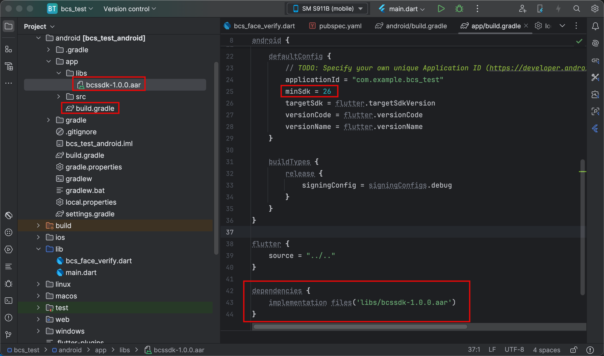

id: bcs-face-flutter

# Como usar BCS en Flutter - Android

## Introducción

En la siguiente guía vamos a ver como integrar el módulo de verificación de identidad de BCS en flutter.

Para poder hacer esto vas a necesitar tener que tener configurado tu entorno para desarrollo flutter.

Vamos a utilizar como IDE `IntelliJ Idea`, pero puede usarse `android studio` o `visual studio code` sin ningun problema, las opciones son muy parecidas.

Podes bajar el código de ejemplo de nuestro repositorio de github que te dejamos aqui abajo:


**Recursos:** 
* [Intellij Idea](https://www.jetbrains.com/idea/)

* [Flutter](https://flutter.dev)

* Código del ejemplo: [GitHub](https://github.com/errobanet/bcs_flutter)

## Primeros pasos

#### Crear la app
Si partis de cero, lo primero que debes hacer es crear la app:

``` bash
$ flutter create bcs_test
```

#### App existente
Si ya tenes una app existente, simplemente seguí los los sigueinte pasos para poder agregar las dependencias y usar BCS.

## Flutter

#### Componente BCS
Para poder utilizar BCS de forma rápida vamos a crear un archivo .dart para tener las funcionalidades disponibles.

*Podes usar los archivos adjuntos en el código de la demo o crearlo manualmente.*

Dentro de la carpeta `lib` crea el archivo: `bcs_face_verify.dart`

``` dart
import 'package:flutter/services.dart';

class BcsFaceVerify {
  final methodChannel = const MethodChannel('net.erroba.bcs');

  Future<VerifyResult> faceVerify(String code) async {
    var ret = await methodChannel.invokeMethod<String>('faceVerify', <String, dynamic>{'code': code});
    return VerifyResult.values.byName(ret!);
  }

  Future<void> setUrlService(String url) async {
    await methodChannel.invokeMethod<String>('setUrlService', <String, dynamic>{'url': url});
  }

  Future<void> setColors(Color primary, Color onPrimary) async {
    await methodChannel.invokeMethod<String>('setColors', <String, dynamic>{'primary': colorToHex(primary), 'onPrimary':  colorToHex(onPrimary)});
  }

  String colorToHex(Color color) {
    String hexColor = color.value.toRadixString(16).padLeft(8, '0');
    return '#${hexColor.substring(2)}'; // Omite los dos primeros caracteres que corresponden al alfa
  }
}

enum VerifyResult { DONE, CANCELED, PERMISSIONS_ERROR, CONNECTION_ERROR, TRANSACTION_NOT_FOUND }
```

## Permisos
La verificación de identidad con rostro necesita algunos permisos en el dispositivo:
 * Cámara
 * Micrófono

Para obtenerlos facilmente vamos a utilizar la siguiente dependencia `permission_handler`

Edita el archivo `pubspec.yaml` y agrega la dependencia. 

``` yaml
dependencies:
  flutter:
    sdk: flutter
  #Otras dependencias
  permission_handler: ^11.3.1
```

<aside class="positive">
No olvides hacer el 'flutter pub get'
</aside>

Para mas información del uso del plugin podes visitar [este sitio.](https://pub.dev/packages/permission_handler)

### Permisos en Android

Edita el archivo `android/app/src/main/AndroidManifest.xml` agregando las siguientes entradas dentro de tag `manifest`:

```xml
<uses-feature android:name="android.hardware.camera" />
<uses-feature android:name="android.hardware.microphone" />

<uses-permission android:name="android.permission.CAMERA"/>
<uses-permission android:name="android.permission.RECORD_AUDIO" />
```

## Android

Ahora vamos a configurar el proyecto de `Android` para utilizar BCS.

### Librerias nativas

Primero vamos a copiar algunas librerias nativas que son necesarias que funcione el proyecto.

1. Copia el archivo `bcssdk-x.x.x.aar` (que esta en [GitHub](https://github.com/errobanet/bcs_flutter/tree/main/android/app/libs)) a la carpeta `android/app/libs`
2. Edita el archivo `android/app/build.gradle`, cambia la `minSdk` por `26` y agrega la dependencia `implementation files('libs/bcssdk-1.0.0.aar')`:

```Groovy
android {
    defaultConfig {
        minSdk = 26
    }
}

dependencies {
    implementation files('libs/bcssdk-1.0.0.aar')
}
```


Debería quedarte algo así:



### Plugin Android - Flutter

Para conectar llamada de flutter y android es necesario registrar un plugin.

Crea el archivo `BCSPlugin` (clase de Kotlin) en el mismo directorio donde esta el archivo `MainActivity`.

```kotlin
package com.example.bcs_test
import android.content.Context
import com.erroba.bcssdk.VerifyCallback
import io.flutter.embedding.engine.FlutterEngine
import io.flutter.embedding.engine.plugins.FlutterPlugin
import io.flutter.plugin.common.MethodCall
import io.flutter.plugin.common.MethodChannel
import io.flutter.plugin.common.MethodChannel.Result

class BCSPlugin : FlutterPlugin{

    private lateinit var channel : MethodChannel
    private lateinit var context: Context
    private val CHANNEL = "net.erroba.bcs"

    fun register(flutterEngine: FlutterEngine) {
        val binaryMessenger = flutterEngine.dartExecutor.binaryMessenger
        channel = MethodChannel(binaryMessenger, CHANNEL)
        channel.setMethodCallHandler(this::onMethodCall)
    }

    fun onMethodCall(call: MethodCall, result: Result) {
        if (call.method == "faceVerify") {
            val code = call.argument<String>("code")
            faceVerify(code!!, result)
        }
        else if (call.method == "setUrlService") {
            val url = call.argument<String>("url")
            setUrlService(url!!, result)
        }
        else if (call.method == "setColors") {
            val primary = call.argument<String>("primary")
            val onPrimary = call.argument<String>("onPrimary")
            setColors(primary!!,onPrimary!!, result)
        }
        else {
            result.notImplemented()
        }
    }

    private fun setColors(primary: String, onPrimary: String, result: MethodChannel.Result) {
        if (com.erroba.bcssdk.BCSClient.setColors(primary, onPrimary)) {
            result.success("OK")
        }
        else {
            result.error("VALIDATION", "Invalid color. Format: #001122", null);
        }
    }

    private fun faceVerify(code: String, result: MethodChannel.Result) {
        com.erroba.bcssdk.BCSClient.startVerify(context, code, VerifyCallback { response ->
            result.success(response.name)
        })
    }

    private fun setUrlService(url: String, result: MethodChannel.Result) {
        if (com.erroba.bcssdk.BCSClient.setUrlService(url)) {
            result.success("OK")
        }
        else {
            result.error("VALIDATION", "Invalid url", null);
        }
    }

    override fun onAttachedToEngine(binding: FlutterPlugin.FlutterPluginBinding) {
        channel = MethodChannel(binding.binaryMessenger, CHANNEL)
        context = binding.applicationContext;
        channel.setMethodCallHandler(this::onMethodCall)
    }

    override fun onDetachedFromEngine(binding: FlutterPlugin.FlutterPluginBinding) {
    }
}
```
### MainActivity 

Es necesario editar el archivo MainActivity para registrar el plugin.

Para hacerlo, tenes que agregar la linea `flutterEngine.plugins.add(BCSPlugin())` dentro de la funcion `configureFlutterEngine`.

A continuación hay una muestra de como queda el archivo:

```kotlin
package com.example.bcs_test

import io.flutter.embedding.android.FlutterActivity
import io.flutter.embedding.engine.FlutterEngine

class MainActivity: FlutterActivity(){
    override fun configureFlutterEngine(flutterEngine: FlutterEngine) {
        super.configureFlutterEngine(flutterEngine)
        flutterEngine.plugins.add(BCSPlugin())
    }
}
```

## Servicio BCS

### Introducción funcionamiento 

Para utilizar la verificación previamente debes haber generado un código de transacción desde el backend de tu aplicación.


<aside class="negative">
Es recomendable NO exponer en tus APIS la identificación de la persona, sino hacerlo sobre algún identificador de onboarding o transacción. De esta froma podes prevenir el uso de tu API x terceros.
</aside>

### Utilización del cliente

A continuacion vamos a mostrar el uso suponiendo que ya tenemos un código de transacción para verificar.

## Verificación

Ya tenemos todo configurado! vamos a usar el cliente!

Para llamar a la verificación solo tenes que llamar la funcion `_bcsFaceVerifyPlugin.faceVerify(code);`

Te dejamos un ejemplo de chequeo de permisos y llamada. Poniendo este codigo en un Widget solo tenes que llamar a la funcion `processVerifyAsync(code)` con el codigo generado en el servidor.

```dart
import 'package:flutter/material.dart';
import 'dart:async';
import 'package:permission_handler/permission_handler.dart';
import 'bcs_face_verify.dart';

Future processVerifyAsync(String code) async{
    final checkPermissions = await this._checkPermissions();
    if (!checkPermissions) {
      /// Manejar permisos denegados
    }
    else {
      var result = await _verifyFace(code);
      /// manejo de respuesta
    }
  }

  Future<VerifyResult> _verifyFace(String code) async {
    return _bcsFaceVerifyPlugin.faceVerify(code);
  }

  Future<bool> _checkPermissions() async {
    var p1 = await Permission.camera.request();
    var p2 = await Permission.microphone.request();
    return p1.isGranted && p2.isGranted;
  }
```

### Respuestas

La respuesta de la llamada a `faceVerify` es una enumeración `VerifyResult`. Puede ser uno de los siguientes valores:

* DONE
* CANCELED
* PERMISSIONS_ERROR
* CONNECTION_ERROR
* TRANSACTION_NOT_FOUND

<aside class="positive">
Según la respuesta obtenida es la acción que debes realizar en tu app.
</aside>

### DONE

La operación finalizó en el servidor, debes obtener el resultado desde tu backend, puede ser tanto Verificado como NO verificado.

### CANCELED

El usuario canceló la operación, generalmente con la opción o gesto de volver.

### PERMISSIONS_ERROR

Esta respuesta se da cuando no hay permisos para cámara y microfono, debes haberlos solicitado antes y verificarlos.

### CONNECTION_ERROR

No fue posible conectar con los servidores de BCS, puede deberse a un problema de conectividad entre el dispositivo e internet/servidores de BCS.

### TRANSACTION_NOT_FOUND

No se encontró la transacción x el identificador `code`. Ten en cuenta que después de creada solo puede ser procesada en un período corto de tiempo. 

## Estilos

La interfaz de la verificación es minimalista, el único control de interacción con el usuario es un botón para `Reintentar` la operación.

Podes establecer los colores para los controles llamando al la función `setColors` del plugin. 

```dart
  Future<void> _initializePluginColors() async {
    // Obtener los colores del tema actual y se los paso al plugin.
    Color primary = Theme.of(context).colorScheme.primary;
    Color onPrimary = Theme.of(context).colorScheme.onPrimary;
    await _bcsFaceVerifyPlugin.setColors(primary, onPrimary);
  }
```

## Ambiente QA/Docker

Por defecto el cliente utiliza el ambiente productivo. Si deseas usar al ambiente de calidad o desarrollo con docker podes cambiar la URL de los servicios.

Para hacerlo esta disponible la funcion `setUrlService` en la api.

```dart
  Future<VerifyResult> _verifyFace(String code) async {
    await _bcsFaceVerifyPlugin.setUrlService("https://url_ambiente");
    return _bcsFaceVerifyPlugin.faceVerify(code);
  }
```

<aside class="negative">
No dejes este codigo en un tu aplicacion RELEASE.
</aside>